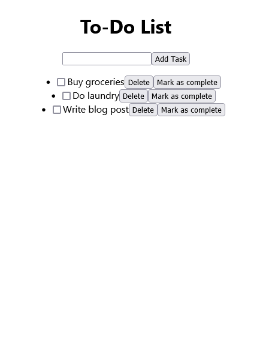

# To-Do List App

A simple and easy to use web-based to-do list application built with ReactJS. This app allows users to create and manage a list of tasks and check off items as they are completed.

## Features
- Add, edit, and delete tasks
- Mark tasks as complete
- Filter tasks by status (all, active, completed)
- Persist data in local storage

## Getting Started

These instructions will get you a copy of the project up and running on your local machine for development and testing purposes.

### Prerequisites

- Node.js and npm (https://nodejs.org/en/download/)
- A modern web browser (Google Chrome, Mozilla Firefox, Safari, etc.)

### Installation

1. Clone the repository
`$ git clone git@github.com:TellMeReact/To-Do-List.git`

2. Change into the project directory

`$ cd to-do-list-app`

3. Install the dependencies

`$ npm install`

4. Start the development server

`$ npm start`

The app should now be running on http://localhost:3000 in your web browser.

## Built With

- ReactJS
- Bootstrap
- Local Storage API

## Contributing

We welcome contributions! If you would like to contribute to this project, please open an issue or submit a pull request.

## License

This project is licensed under the MIT License - see the [LICENSE.md](LICENSE.md) file for details.
